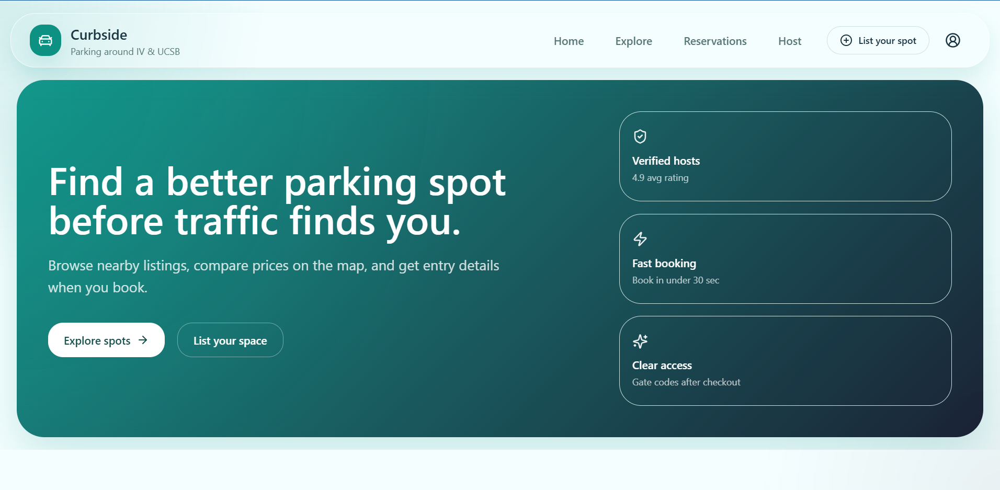
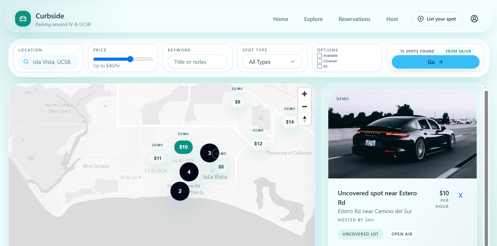
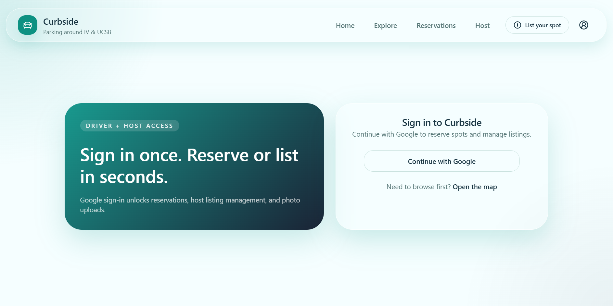

# Curbside

Parking marketplace MVP for Isla Vista / UCSB — find and reserve driveway, garage, and lot spots on a map. Built with Next.js, TypeScript, Tailwind, Supabase, and Mapbox.

## What I built

- **Explore map** — browse demo + real listings with filters, price markers, and spot details
- **Reservations** — book a spot with guest contact info, view access instructions
- **Host dashboard** — publish listings, upload photos, manage reservations
- **Google sign-in** — Supabase Auth with protected routes

## Setup

1. Install dependencies:

```bash
npm install
```

2. Copy `.env.example` to `.env.local` and fill in the three variables (see [docs/SECRETS.md](docs/SECRETS.md)).

3. In Supabase SQL Editor, run [supabase/setup.sql](supabase/setup.sql) for a new database. If you already have tables, run the files in `supabase/migrations/` instead.

4. Supabase Auth → enable Google provider:
   - Site URL: `http://localhost:3000`
   - Redirect URL: `http://localhost:3000/auth/callback`

5. Google Cloud Console → add the same callback to your OAuth client.

6. Start the app:

```bash
npm run dev
```

## Project structure

```
app/              # routes and pages
components/       # UI by feature (home, host, booking, etc.)
docs/             # setup, testing, secrets, monitoring
lib/
  actions/        # server actions
  config/         # env, constants, feature flags
  data/           # demo spots + cookie bookings
  domain/         # booking rules, reservations, ownership
  helpers/        # formatting, validation, redirects
  integrations/   # mapbox, geocoding, photo uploads
  monitoring.ts   # optional Sentry
  supabase/       # client + queries
  types/          # shared TypeScript types
public/           # screenshots and static assets
scripts/          # dev tooling
supabase/         # SQL schema, migrations, seed data
```

## Demo vs real listings

- **Demo spots** (`demo-*` IDs) live in `lib/data/demo-spots.ts` — shown on the map in **dev** by default.
- In **production**, demo spots are hidden unless you set `NEXT_PUBLIC_ENABLE_DEMO_SPOTS=true` in env.
- **Seed spots** (`supabase/seed-example-spots.sql`) are example UUID listings; they show a Demo badge, not "Your listing."
- **Your listings** come from Supabase after you publish from the host dashboard.

## Screenshots

### Home

Landing page with hero and links to explore the map or list a spot.



### Explore

Map with price markers, filters, and spot detail panel.



### Sign in

Google OAuth via Supabase Auth.



## Monitoring

Optional Sentry setup: [docs/MONITORING.md](docs/MONITORING.md)

## SQL files

| File | When to run |
|------|-------------|
| `supabase/setup.sql` | Fresh database — full schema |
| `supabase/migrations/*.sql` | Existing DB — incremental updates |
| `supabase/seed-example-spots.sql` | Optional sample data |

## Testing

See [docs/TESTING.md](docs/TESTING.md) for the manual test checklist before pushing to GitHub.

## Secrets

Never commit `.env.local`. See [docs/SECRETS.md](docs/SECRETS.md).
